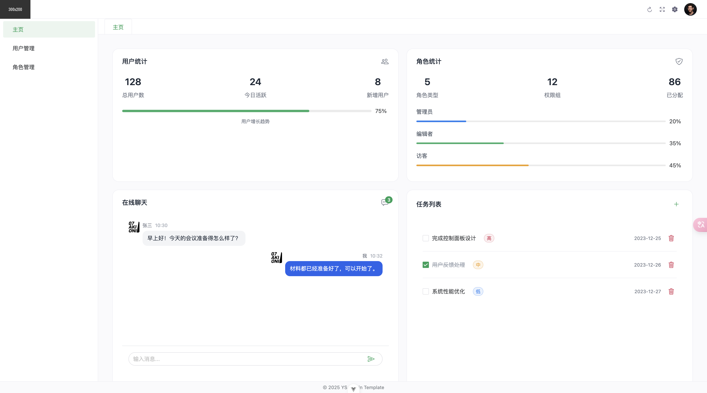
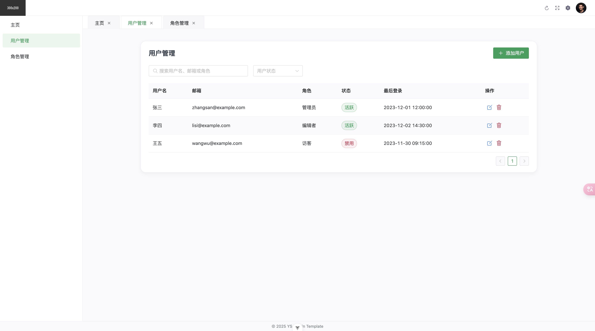

# Website

一个基于 Vue 3 的现代化前端管理系统模板，集成了多项实用功能和最佳实践。

## 📸 预览

  

## ✨ 特性

- 🎯 **Vue 3 + Vite**：采用 Vue 3 Composition API 和 Vite 构建工具
- 🎨 **NaiveUI**：集成美观易用的 NaiveUI 组件库
- 🌍 **国际化**：基于 vue-i18n 的多语言支持 <!-- - 🎭 **主题配置**：灵活的主题配置功能 -->
- 📦 **组件自动导入**：基于 unplugin-vue-components 的组件自动导入 <!-- - 📱 **响应式设计**：适配不同尺寸屏幕 -->
  <!-- - 🔐 **权限管理**：完善的权限控制系统 -->
- 🔍 **Mock 数据**：集成 Mock.js 进行数据模拟 <!-- - 🧪 **测试工具**：集成 Vitest 单元测试和 Playwright E2E 测试 -->

## 🚀 技术栈

- **核心框架**：Vue 3
- **构建工具**：Vite 6
- **UI 框架**：Naive UI
- **状态管理**：Pinia
- **路由工具**：Vue Router 4
- **HTTP 工具**：Axios
- **国际化**：Vue I18n
- **CSS 预处理**：Sass
- **代码规范**：ESLint + Prettier + Oxlint <!-- - **单元测试**：Vitest --> <!-- - **E2E测试**：Playwright -->
-

## 📦 安装

```bash
pnpm install
```

## 🔧 开发

```bash
pnpm dev
```

## 🏗️ 构建

```bash
pnpm build
```

<!-- ## 🧪 测试

### 单元测试

```bash
pnpm test:unit
```

### E2E 测试

```bash
# 首次运行需要安装浏览器
npx playwright install

# 运行所有测试
pnpm test:e2e

# 仅在 Chromium 中运行测试
pnpm test:e2e --project=chromium

# 运行指定测试文件
pnpm test:e2e tests/example.spec.ts

# 调试模式运行测试
pnpm test:e2e --debug
``` -->

## 📝 代码规范

```bash
# ESLint 检查并修复
pnpm lint

# 格式化代码
pnpm format
```

## 🔧 开发工具配置

推荐使用 [VSCode](https://code.visualstudio.com/) +
[Vue Language Features (Vue)](https://marketplace.visualstudio.com/items?itemName=Vue.vscode-typescript-vue-plugin)
进行开发。

## 📄 许可证

[MIT](LICENSE)
